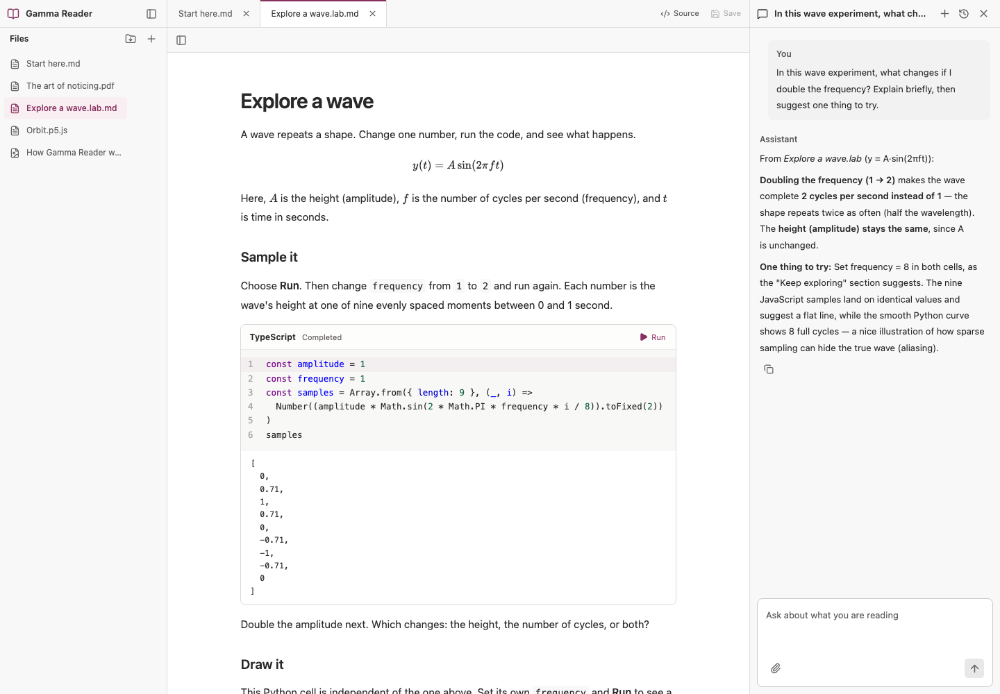
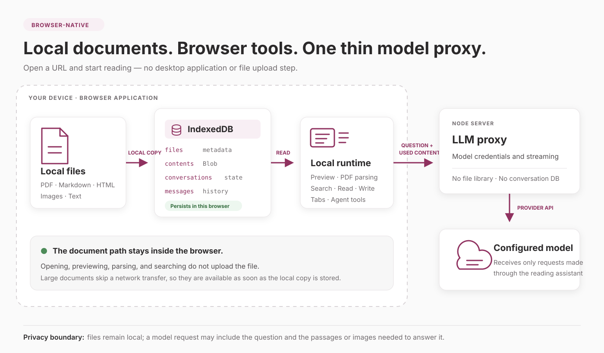

# Gamma Reader

A browser-native, local-first workspace for reading, experimenting, and creating with AI — powered by [pi](https://github.com/earendil-works/pi).

[Try Gamma Reader](https://reader.upivot.io) — no account, desktop app, or personal API key required.

[](https://reader.upivot.io)

## Read. Experiment. Create.

**Read** local documents in tabs. Ask the assistant to find a passage, explain an image, or compare sources. Keep separate conversations for different questions.

**Experiment** inside `.lab.md` articles with runnable Scheme, Clojure, Python, and TypeScript cells, or explore interactive `.p5.js` sketches. Edit the code and run it yourself; language runtimes load on demand.

**Create** notes, diagrams, and experiments with the agent, or edit text files in the Source panel. Save your work in the browser and export it to your computer.

A Lab is ordinary Markdown with executable fences:

````markdown
```python run id=hello
print("Hello from the browser")
```
````

New workspaces include **Start here.md**, a PDF, a wave Lab, an orbit sketch, and an architecture diagram. Follow the examples, then add your own files with **+**. Existing workspaces keep their files unchanged.

## Local-first by design

Files are copied directly into IndexedDB. Built-in document previewing, parsing, and searching happen in the browser, so adding a large document does not require a file upload to the application server. The pi agent loop and document tools also run in the browser.

AI inference runs at the model provider: questions, conversation context, and text or images supplied by tools pass through a small Node proxy. The server holds model credentials but has no file library or conversation database. Code runtimes may download dependencies and executed code can make network requests.



Files, attachments, and conversations persist in **IndexedDB**; tabs and the last active file use **localStorage**. Unsaved Source drafts and code execution state stay in memory. **Save** (⌘/Ctrl+S) saves a Source draft to the browser; **Save as…** and folder export write saved copies to your computer. Lab outputs are not included in the exported Markdown.

Browser storage belongs to this site and browser profile. Export work you want to keep beyond it. Removing a file deletes only the browser copy, leaving your original unchanged.

## Document support

| Format | Experience | Agent support |
| --- | --- | --- |
| PDF | Outline, page navigation, progress, zoom, and pan | Search and read extracted text; no OCR |
| Markdown | Math, Mermaid, outline, local images, and editable Source | Search, read, and edit source drafts |
| `.lab.md` | Markdown with editable code cells and Run controls | Read and edit source; execution stays user-controlled |
| `.p5.js` | Interactive sketches, Source, and Run changes | Read and edit source |
| HTML | Sandboxed preview and editable Source | Active source tools; no text search |
| Images / SVG | Image preview and zoom; SVG also has editable Source | Vision analysis; SVG active source tools |
| UTF-8 text | Text preview and editable Source | Search, read, and edit source |
| Other formats, including Word | Stored in Files | No preview or text reading yet |

Limits: 200 MiB per file, 1 GiB per browser library (including attachments), and 5 MiB for text preview and reading. Available storage also depends on the browser's quota and device space. Python and Clojure require runtime downloads on first use. Folder export requires desktop Chrome or Edge; individual files can also be downloaded.

## Run locally

Use Node 24 and pnpm 10.14.0.

```sh
corepack enable
pnpm install
GLM_API_KEY=your-key pnpm dev
```

Open [http://localhost:5302](http://localhost:5302). Reading, editing, and experiments work without a model key; chat is disabled.

| Variable | Default | Purpose |
| --- | --- | --- |
| `GLM_API_KEY` | Required for chat | Server-side model credential |
| `GLM_MODEL` | `glm-5.3` | Main reading model |
| `GLM_VISION_MODEL` | `glm-5.3-flash` | Image analysis model |
| `PORT` | `3302` | Node service port |
| `HOST` | `127.0.0.1` | Node service host |
| `GAMMA_BACKEND` | `http://127.0.0.1:3302` | Vite proxy target |

## Production

Create an untracked `.env` containing `GLM_API_KEY`, then run:

```sh
docker compose -f compose.production.yml up -d --build --wait
```

The container serves the web app and Node proxy on port `3302` and exposes `/api/health`.

## Development

```sh
pnpm check
pnpm build
```

`check` runs Biome, TypeScript, and package tests without rewriting source. Tests do not call external model services.

The independent React Code Lab package lives in `ui-packages/code-lab`. Run its standalone examples with `pnpm --filter @gamma-reader/code-lab-playground dev`.

## License

[MIT](LICENSE)
