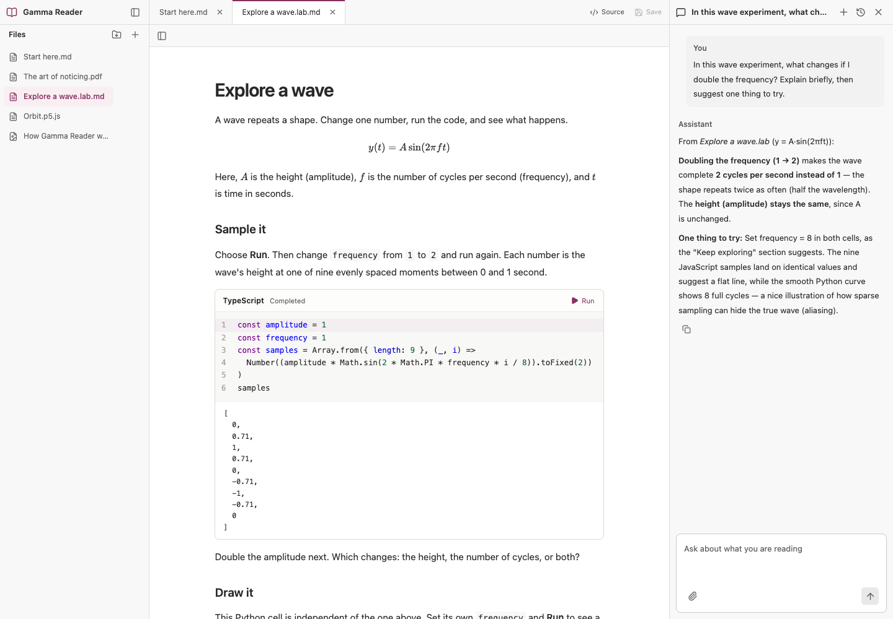

# Gamma Reader

A browser-native, local-first workspace for reading, experimenting, and creating with AI, powered by [pi](https://github.com/earendil-works/pi).

[Try Gamma Reader](https://reader.upivot.io). Your documents stay in your browser, and there is no account to create.

[](https://reader.upivot.io)

## Features

The app opens on a Tutorial project that shows every feature in use; its chapters are also readable here, in [`tutorial/`](tutorial/Start%20here.md).

- **Read** PDF, Word, Excel, CSV, Markdown, HTML, images and source code in tabs, each with the controls its format allows. See [Reading documents](tutorial/guide/Reading%20documents.md).
- **Write** Markdown with formulas, diagrams and images, and save it in the browser. See [Writing in Markdown](tutorial/guide/Writing%20in%20Markdown.md).
- **Link notes** by name with `[[…]]`, see what links back, and embed one note, section or passage in another. See [Links and embeds](tutorial/guide/Links%20and%20embeds.md).
- **Run code** in Labs, Markdown with Scheme, Clojure, Python and TypeScript cells, and embed p5 sketches and HTML pages at any size. See [Labs](tutorial/guide/Labs.md) and [Interactive pages](tutorial/guide/Interactive%20pages.md).
- **Ask the assistant** about what you read: it searches and reads your files, compares sources, runs Lab cells, searches the web when allowed, and writes notes. Its agent loop runs in the browser. See [The reading assistant](tutorial/guide/The%20reading%20assistant.md).
- **Organise** files in projects, bring in folders and links, and keep a project in step with a source. See [Files and projects](tutorial/guide/Files%20and%20projects.md).
- **Keep your files local.** Documents are stored in the browser and never uploaded to an application server. See [Your data and models](tutorial/guide/Your%20data%20and%20models.md).

## Local-first by design

Files are copied into IndexedDB, and previewing, parsing, searching and the pi agent loop all run in the browser. AI inference runs at the model provider: on the shared allowance through a small Node proxy that holds the credentials and keeps no files or conversations, and with a reader's own key straight from the browser. When a reader turns on web search, the agent's queries go through this server to Tavily.


## Chat models and limits

The shared key carries a daily allowance. Each network gets `GAMMA_DAILY_TOKENS` tokens per day, counted from the usage the provider reports on its final response chunk, and resets at 00:00 UTC. Requests over the limit are refused with `429` and the reader sees the reason in the conversation. A network is identified by its address, so people behind one office or campus connection share a single allowance.

Because anyone can reach a fresh allowance from a fresh address, `GAMMA_TOTAL_DAILY_TOKENS` caps what everyone together may spend in a day. It is the figure that stays put when the addresses do not, and the two refusals are worded apart so a reader can tell their own allowance from the service's.

A reader's own model, added with **Add your own model…**, is called from the browser directly and is not counted. Keys are kept in `localStorage`, not the workspace database: Code Lab runs reader-supplied TypeScript in a same-origin worker that can reach `indexedDB`, and `localStorage` does not exist in worker scope.

## Run locally

Use Node 24 and pnpm 10.14.0.

```sh
corepack enable
pnpm install
pnpm dev
```

Create an untracked root `.env` with `GLM_API_KEY`, `DEEPSEEK_API_KEY`, or both. The Node server loads this file for local development and `pnpm start`; existing process environment variables take precedence. Open [http://localhost:5302](http://localhost:5302). Reading, editing, and experiments work without keys; chat requires at least one configured provider.

| Variable | Default | Purpose |
| --- | --- | --- |
| `GLM_API_KEY` | Unset | Server-side credential for Z.AI Coding CN |
| `DEEPSEEK_API_KEY` | Unset | Server-side credential for DeepSeek |
| `TAVILY_API_KEY` | Unset | Server-side credential for Tavily; when set, the chat offers a web search switch |
| `GAMMA_SEARCH_PROXY` | Unset | HTTP proxy for web search requests only, such as `http://172.17.0.1:1080` |
| `PORT` | `3302` | Node service port |
| `HOST` | `127.0.0.1` | Node service host |
| `GAMMA_BACKEND` | `http://127.0.0.1:3302` | Vite proxy target |
| `GAMMA_DAILY_TOKENS` | `200000` | Tokens one network may spend per day |
| `GAMMA_TOTAL_DAILY_TOKENS` | `20000000` | Tokens everyone together may spend per day |
| `GAMMA_DATA_DIR` | `data` | Directory holding the usage database |
| `GAMMA_TRUST_PROXY` | Unset | Set to `1` when a reverse proxy sets `X-Forwarded-For` |
| `GAMMA_TUTORIAL_DIR` | `tutorial/` at the repository root | The folder served as the Tutorial; see [Tutorial](#tutorial) |
| `GAMMA_SOURCE_NAME` | Unset | Name of the source the library syncs from; see [Sync from a repository](#sync-from-a-repository) |
| `GAMMA_SOURCE_WORKTREE` | Unset | A git working tree on this machine, served as it is on disk |
| `GAMMA_SOURCE_REPO` | Unset | A git repository the server clones and keeps pulling |
| `GAMMA_SOURCE_URL` | Unset | Or an address that already serves a source |
| `GAMMA_SOURCE_EXCLUDE` | Unset | Folders of the repository to leave out, comma separated |
| `GAMMA_SOURCE_INCLUDE` | Unset (all) | Folders of the repository to list, comma separated, when only some are wanted |
| `GAMMA_SOURCE_DIR` | `$GAMMA_DATA_DIR/source` | Where a cloned repository lives |
| `GAMMA_SOURCE_PULL_SECONDS` | `120` | How often a cloned repository is pulled |
| `GAMMA_SOURCE_PUSH` | Unset | `1` commits Save to a cloned repository and pushes it; see [Saving back to a repository](#saving-back-to-a-repository) |

Configure enabled providers, chat models, the default chat model, and the independent vision model in [`providers.json`](web-packages/server/src/model-proxy/providers.json). Credentials stay in the environment; the JSON references their variable names. Model names, supported thinking levels, upstream API addresses, and request mappings come from pi's native provider definitions. There are no model environment overrides or application-defined effort lists.

The initial configuration enables GLM-5.3 / GLM-5.2 and DeepSeek V4 Flash / V4 Pro, with GLM-5.3 as the default and GLM-5.3-Flash for vision. Providers without a key are omitted from the selector. If the default provider is unavailable, the first available model in configuration order is used. If the vision provider is unavailable, text chat remains usable without vision tools.

Thinking levels are normalized with pi's `clampThinkingLevel`; new conversations start from pi Agent's `off` level, normalized for the selected model. For example, GLM-5.3 starts at `low`, while DeepSeek starts at `off`.

## Tutorial

[`tutorial/`](tutorial/) ships with each deployment and is served at `/api/tutorial`, listed afresh on each request. Every reader has a Tutorial project kept in step with it: a first visit opens it, and after a deployment that changes the folder, the project offers **Update**. To write for it, edit the folder and run `pnpm dev`; the open Tutorial offers the change at once. Add a section to [`What's new.md`](tutorial/What's%20new.md) when a release adds a feature.

## Sync from a repository

A project can follow a git repository instead of files added by hand. Name the source and point at the repository:

```sh
GAMMA_SOURCE_NAME=notes GAMMA_SOURCE_WORKTREE=$HOME/notes pnpm dev
```

The reader opens a project named after the source and offers **Update** whenever the repository has changed; it checks when the library opens and when its tab comes back into view, at most once a minute. Sync from a clone or an address only brings files in, and the source has the last word on what it changes: an update replaces a browser edit to a file the source changed, and says so first, while files the source did not change stay as they are in the browser. A working tree can also take changes back — see [Saving back to a working tree](#saving-back-to-a-working-tree) — and so can a clone the server pushes to — see [Saving back to a repository](#saving-back-to-a-repository).

Set exactly one of these with `GAMMA_SOURCE_NAME`:

| Variable | Serves | Changes show |
| --- | --- | --- |
| `GAMMA_SOURCE_WORKTREE` | The files on disk, committed or not, leaving out what git ignores | As soon as they are saved |
| `GAMMA_SOURCE_REPO` | The committed files of a clone the server keeps under `GAMMA_SOURCE_DIR` | After the next pull, every `GAMMA_SOURCE_PULL_SECONDS` |
| `GAMMA_SOURCE_URL` | Whatever that address serves: `GET <url>` lists `{ version, files: [{ path, version, size }] }`, and `GET <url>/files/<path>` returns a file | When that address says so |

Give paths in full: `.env` does not expand `~` or `$HOME`. A source holds the whole repository but what git ignores and hidden files and folders, such as `.github/`. `GAMMA_SOURCE_EXCLUDE=meta,tmp` also leaves those folders out, and `GAMMA_SOURCE_INCLUDE=knowledge,journal` limits it to those folders instead; a hidden folder named there, such as `.github`, is held too, though nothing hidden inside it is. A file outside the source is neither listed nor saved, and the reader says which rule left it out. For a private repository, give git its key with `GIT_SSH_COMMAND`. The default container image has no git; build one that serves a repository with `docker build --target runtime-git`. The server does not check who asks for the files, so a deployment that serves a repository must sit behind a sign-in.

### Saving back to a working tree

A working tree also takes changes back. Its project checks for updates every minute and brings them in without asking, and the **Save** button above Files writes what changed in the browser since the last update to the folder: edits, new files, moves, and deletions. Deleting files on disk is confirmed first. Nothing is committed; review and commit the changes with git as usual.

Save compares the library with what it last brought in, so any change made here counts, however it was made. Each file is sent with the version it started from:

- A file nobody else changed is written as it is.
- A file someone changed on disk meanwhile — in an editor, or by an agent — is merged with `git merge-file`. Edits to different lines combine on their own; edits to the same line leave conflict markers in the file, and the reader names it so you can resolve it in your editor. The resolved file comes back with the next update.
- A file you edited that was deleted on disk meanwhile stays deleted; your copy remains here as a new file, and saving again writes it back. A file you deleted that was changed on disk meanwhile is kept, and the next update brings it back here. The reader says which files these are.

A project saves only to the folder it was synced from. Pointing the same source name at another folder blocks Save for that project; give the new folder its own name.

### Saving back to a repository

With `GAMMA_SOURCE_PUSH=1`, a clone takes changes back too: Save works as it does for a working tree, and the server commits what it wrote and pushes it to the branch it cloned at once, so the repository's history records every save. The clone's key must be allowed to push.

- Each save starts from the repository's latest commit, and saves take turns with the pulls. A file someone changed meanwhile is merged as it is in a working tree.
- A clash on the same lines is never committed. The reader gets the file back with both sides marked in it, resolves it there, and saves again; a file that still holds the markers is not saved.
- A push the repository refuses because it moved on is replayed on its newer commit once. If that fails too, the clone goes back to the repository's commit and the changes stay in the browser to save again.

A commit's author is the reader the sign-in in front of the server names in `X-Forwarded-Email` and `X-Forwarded-User`, as oauth2-proxy passes them; without them it is Gamma Reader. The server believes these headers as given, so serve it only through that sign-in.

## Operating the proxy

The server holds the model credentials, so it also caps what they can spend. Fetching `/api/agent/config` sets a signed, HTTP-only cookie, and the chat routes refuse requests without it. Pointing an OpenAI-compatible client at the proxy address therefore does not work; anyone determined enough can still read the cookie first, which is why a limit backs it up rather than replaces it.

Two records are kept in a SQLite file under `GAMMA_DATA_DIR`, deliberately separated:

- **The day's counter** stores a salted hash of the network address against the tokens it has spent. This is what the limit reads, and it is the only record that relates to a person, so it holds **today only** — the previous day is dropped the first time a request arrives on a new one. The hash keeps the file from reading as a list of visitors, but an address is short enough to recover from a hash, so it is the short retention rather than the hash that does the protecting.
- **The request log** stores, for every charged request, its timestamp, its token count, and a grouping number that ties together the several requests one question makes. It carries no address, hashed or otherwise, and the grouping number is assigned in memory and never linked to anything, so it is kept indefinitely. Daily and monthly totals come from here.

The same file also keeps the cookie signing secret and the hashing salt, so a restart neither signs readers out nor resets anyone's allowance.

Set `GAMMA_TRUST_PROXY=1` only when a reverse proxy sets `X-Forwarded-For`, as `compose.production.yml` assumes: the last entry of that header is then treated as the caller. Without a proxy in front, leave it unset so the header cannot be forged.

To stop or restrain spending, change `GAMMA_TOTAL_DAILY_TOKENS` in `.env` and run the deploy command again; the container is recreated in seconds and the new ceiling applies at once. There is no runtime switch on purpose, since that would be one more thing to authenticate.

Two costs are bounded before a request is forwarded. A caller without the pass cookie is refused before their body is read, so an anonymous request cannot make the server buffer and parse twelve megabytes. An image is measured from its own header rather than from what the caller claims, and one covering more than four megapixels is refused with `413` — a picture the reader itself renders never comes close, since it already fits a page into four megapixels and an upload into 1.5.

`packages/shared` exports only the public configuration types. UI and Server import these types independently; neither package imports the other. The browser requests `/api/agent/config` and sends pi-generated requests through `/api/agent/providers/:provider/chat/completions` (or the provider's `/vision/chat/completions` route). The server injects the corresponding credential.

## Production

Create an untracked `.env` containing either or both provider keys, then run:

```sh
docker compose -f compose.production.yml up -d --build --wait
```

The container serves the web app and Node proxy on port `3302` and exposes `/api/health`.

The project menu shows the version, such as `Gamma Reader 1.0.0 (46b53a0)`: the latest `v` tag and the commit, as `git describe` names them. A release is a tag on the commit it ships, raising the minor number when it brings new features and the patch number when it only fixes:

```sh
git tag v1.1.0 && git push origin v1.1.0
```

The image has no `.git`, so a deployment passes the version in, and the commit as the image tag:

```sh
export GAMMA_READER_TAG=$(git rev-parse --short HEAD)
export GAMMA_READER_VERSION=$(git describe --tags --long --always --match 'v[0-9]*')
docker compose -f compose.production.yml up -d --build --wait
```

A local build reads the version from the checkout.

The `quota` volume holds the usage database; removing it (`docker compose down -v`) resets every allowance, signs readers out, and discards the request log. JSON configuration ships with the server build; rebuild and restart after changing it. Deploy the frontend and server together. Saved conversations remain compatible across updates; refresh already-open pages after one.

## Development

```sh
pnpm check
pnpm build
```

`check` runs Biome, TypeScript, and package tests without rewriting source. Tests do not call external model services.

The independent React Code Lab package lives in `ui-packages/code-lab`. Run its standalone examples with `pnpm --filter @gamma-reader/code-lab-playground dev`.

## License

[MIT](LICENSE)
