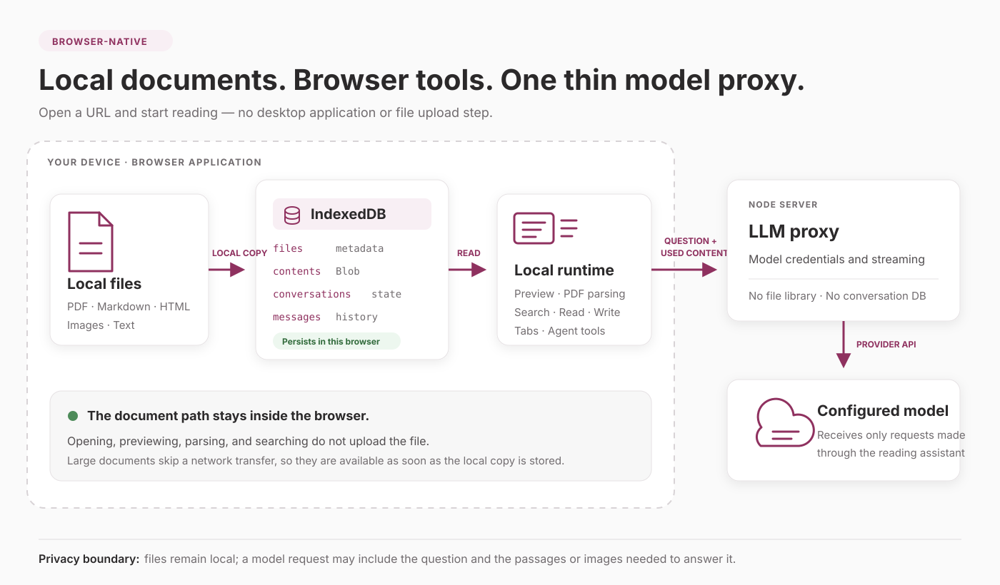

# Gamma Reader

A browser-native, local-first workspace for reading, experimenting, and creating with AI — powered by [pi](https://github.com/earendil-works/pi).

[Try Gamma Reader](https://reader.upivot.io) — your documents stay in your browser, and there is no account to create.

The shared key comes with a daily allowance. [Add a key of your own](#chat-models-and-limits) and it no longer applies.

[](https://reader.upivot.io)

## Features

- **Read** PDF, Word, Excel, Markdown, HTML, images, source code, and text in tabs, each with the navigation its own format allows — an outline, sheet tabs, page controls, a reading theme, highlighted code with line numbers. [Document support](#document-support) lists what each format offers.
- **Run code inside documents** — `.lab.md` articles carry executable Scheme, Clojure, Python, and TypeScript cells, and `.p5.js` sketches are interactive. A cell can show its result as a typeset formula, and language runtimes load on demand.
- **Ask about what you are reading.** The assistant searches and reads your open documents, explains images, and compares sources; its agent loop runs in the browser, not on a server.
- **Keep questions apart.** Conversations are separate, each with its own history, chat model, and thinking level. The model names each one after its first reply, and you can rename it from history. A line under the message box shows how much of the model's context the conversation fills and how many tokens it has used.
- **Keep talking while it answers.** A message sent during a reply waits in a queue and reaches the model at its next step; Escape stops the reply and sends the queue at once. Type `/` for commands — `/clear` starts a new conversation.
- **Work in projects.** Each project keeps its own files, conversations, and tabs, and the assistant sees only the project it is in. A project opens in its own browser tab, so assistants in different projects can work at the same time — see [Projects](#projects).
- **Bring in whole folders, or a link.** Add or drop a folder, such as a source repository, and Files keeps its tree while leaving out dependencies and build output. Paste an arXiv paper, a GitHub file or repository, or any other link to bring it in — see [Folders](#folders).
- **Find a file by its path.** A filter above Files narrows a large library as you type, keeping each match in its folders.
- **Follow a repository.** A project can stay in step with a git repository on your machine or a server, offering **Update** when it changes — see [Sync from a repository](#sync-from-a-repository).
- **Write, not just read.** Edit any text document in the Source panel, or let the assistant draft into it, and ask it to move or rename files to tidy a project. Save to the browser with ⌘/Ctrl+S, and write copies back to your computer with **Save as…** or folder export.
- **Bring your own model key** and run outside the shared allowance — see [Chat models and limits](#chat-models-and-limits).
- **Keep your files local.** Documents are stored in the browser and are never uploaded to an application server.

A Lab is ordinary Markdown with executable fences:

````markdown
```python run id=hello
print("Hello from the browser")
```
````

When a cell's last value is a formula, it is typeset with KaTeX instead of printed:

| Language | Write |
| --- | --- |
| Python | Any value with `_repr_latex_`, as in Jupyter — a SymPy expression such as `diff(x*sin(x), x)` |
| TypeScript | An object with `toLatex()` returning TeX, such as ``({ toLatex: () => String.raw`\frac{1}{2}` })`` |
| Scheme | `(latex "e^{i\\pi} + 1 = 0")` |
| Clojure | `(latex "e^{i\\pi} + 1 = 0")`, or `user/latex` after switching namespaces |

Only the last value counts: printed output stays text.

The first project includes **Start here.md**, a PDF essay, a Word document with the spreadsheet it describes, two Labs covering all four languages, an orbit sketch, and an architecture diagram. Follow the examples, then add your own files or folders by dragging them onto Files or with **+**. New projects start empty. Files kept before projects existed become the first project, **My reading**, unchanged.

## Projects

The name at the top of Files is the current project. Open it to switch to another project, create one, rename this one, or delete it. **View storage** shows what the project keeps in this browser: its database, its size against the 1 GiB limit, and how many records each table holds. Another project opens in its own browser tab, and choosing it again returns to that tab instead of loading the project a second time, so a reply in progress there carries on. A new project's link appears once the project is saved.

The address names the project — `/p/<id>/files/<document>` — so a bookmark or a second tab opens the same one. `/` opens the project used most recently, and links from before projects existed open in **My reading**.

Deleting a project removes its files, conversations, and saved tabs from this browser; the dialog offers to save the files to a folder first. If another tab still has the project open, deletion waits until that tab closes. Deleting every project leaves an empty page from which a new one can start.

## Folders

Files are kept on folder paths and shown as a tree whose folders start collapsed; the open document's folders unfold on their own. **+ → Add folder…** brings in a folder with its structure, and so does dropping one onto Files. Desktop Chrome and Edge read the folder directly; other desktop browsers use their folder upload, and iPhone and iPad offer only files.

Type in **Filter** above the tree to show only the files whose path holds every word typed, ignoring case — `pi readme` finds `notes/pi/README.md`. Folders holding a match open while the filter is on and return to how you left them when it is cleared. **Enter** opens the first match and **Escape** clears the filter.

**+ → Add from URL…** brings in a file or folder from an address. The browser downloads it directly:

| Address | Result |
| --- | --- |
| arXiv paper (`abs/<id>` or `pdf/<id>`) | The paper's PDF, opened |
| GitHub file (`blob/<ref>/<path>`) | The file, opened |
| GitHub repository or folder (`tree/<ref>/<dir>`) | Added as a folder, under the rules below |
| Any other `https` link | Downloaded as it is, if the site allows cross-origin reads |

GitHub lists at most 60 folders an hour for each network, and private repositories cannot be read.

A folder is imported for reading, not mirrored, so some of it stays out:

- Folders named `node_modules`, `dist`, `build`, `out`, `target`, `coverage`, `__pycache__`, or `venv`, and any folder whose name starts with `.`, are never entered.
- Hidden files, files over 1 MiB, and formats Gamma Reader cannot read are left out, and the status bar says how many.
- A folder with more than 5,000 readable files is refused as a whole.

Files already in the library are either replaced or skipped, so importing a folder again with **Replace** brings in what changed since. A folder row's remove button takes every file under it out of the library at once and closes their tabs; your folder on disk is untouched. Folder export recreates the tree on disk.

## Local-first by design

Files are copied directly into IndexedDB. Built-in document previewing, parsing, and searching happen in the browser, so adding a large document does not require a file upload to the application server. The pi agent loop and document tools also run in the browser.

AI inference runs at the model provider. On the free allowance, questions, conversation context, and text or images supplied by tools pass through a small Node proxy that holds the model credentials; it has no file library or conversation database. With a key you configured yourself, the browser calls the provider directly and nothing about that conversation reaches this application's server. Code runtimes may download dependencies and executed code can make network requests. When a reader turns on web search in a conversation, the agent's search queries go through this application's server to Tavily, even with a key you configured yourself; so does the address of a page the agent saves as text because the browser may not download it.



Files, attachments, and conversations persist in **IndexedDB**, one database per project, with a small registry listing the projects; tabs, the last active file, where you stopped in each open document, and any model keys you configure use **localStorage**. Unsaved Source drafts and code execution state stay in memory. **Save** (⌘/Ctrl+S) saves a Source draft to the browser; **Save as…** and folder export write saved copies to your computer. Lab outputs are not included in the exported Markdown.

Browser storage belongs to this site and browser profile. Export work you want to keep beyond it. Removing a file deletes only the browser copy, leaving your original unchanged.

## Document support

| Format | Experience | Agent support |
| --- | --- | --- |
| PDF | Outline, page navigation, progress, zoom, pan, and reading theme | Search and read extracted text; no OCR |
| Markdown | Math, Mermaid, outline, local images, editable Source, and adjustable text size, width, and theme | Search, read, and edit source drafts |
| `.lab.md` | Markdown with editable code cells and Run controls | Read and edit source; execution stays user-controlled |
| `.p5.js` | Interactive sketches, Source, and Run changes | Read and edit source |
| HTML | Sandboxed preview and editable Source | Active source tools; no text search |
| Images / SVG | Image preview and zoom; SVG also has editable Source | Vision analysis; SVG active source tools |
| UTF-8 text | Text preview and editable Source | Search, read, and edit source |
| Source code | Read-only view with highlighting, line numbers, folding, and search | Search, read, and rewrite whole files |
| CSV | Spreadsheet grid that follows edits in the editable Source; a single-column file shows as text | Search, read, and edit source as text |
| Word (`.docx`) | Read-only preview converted to Markdown, with outline and adjustable text size, width, and theme | Search and read converted text |
| Excel (`.xlsx`) | Read-only grid with sheet tabs, column letters, and row numbers | Search, and read by sheet and A1 range |
| Other formats | Stored in Files | No preview or text reading yet |

Word and Excel are read from the modern `.docx` and `.xlsx` only; the older binary `.doc` and `.xls` are stored but not read. Both keep structure and drop presentation: a document loses page layout, fonts, headers and footers, and tracked changes, while a sheet arrives without cell colours, charts, or images and a formula shows the value it was saved with. Neither is decoded as text, so the 5 MiB limit below does not reach them — a large illustrated document takes a few seconds to open, and a very wide sheet is previewed to a hundred columns while the assistant reads them all. Equations, charts, SmartArt, and embedded objects that cannot be shown are marked where they stood, such as *(Equation not converted)*, so neither you nor the assistant reads past a gap; comments are numbered in the text and listed at the end.

A `.csv` is plain text, so the 5 MiB limit applies and the assistant reads it as text. Its fields may be separated by commas, semicolons, or tabs, whichever its first line uses.

Limits: 200 MiB per file, 1 GiB per project (including attachments), and 5 MiB for text preview and reading. Available storage also depends on the browser's quota and device space. Python and Clojure require runtime downloads on first use. A Lab cell's printed output keeps its first and last 32,000 characters, with a note of what was left out between. Folder export requires desktop Chrome or Edge; individual files can also be downloaded.

## Chat models and limits

Model choices and thinking levels persist with each conversation.

The shared key carries a daily allowance. Each network gets `GAMMA_DAILY_TOKENS` tokens per day, counted from the usage the provider reports on its final response chunk, and resets at 00:00 UTC. Requests over the limit are refused with `429` and the reader sees the reason in the conversation. A network is identified by its address, so people behind one office or campus connection share a single allowance.

Because anyone can reach a fresh allowance from a fresh address, `GAMMA_TOTAL_DAILY_TOKENS` caps what everyone together may spend in a day. It is the figure that stays put when the addresses do not, and the two refusals are worded apart so a reader can tell their own allowance from the service's.

**Add your own model…** at the end of the model selector takes a key for one of the providers pi ships, or for any OpenAI-compatible address. Those requests go from the browser straight to the provider, so they never reach this server and the allowance does not apply.

Keys are kept in `localStorage`, not the workspace database: Code Lab runs reader-supplied TypeScript in a same-origin worker that can reach `indexedDB`, and `localStorage` does not exist in worker scope.

## Run locally

Use Node 24 and pnpm 10.14.0.

```sh
corepack enable
pnpm install
pnpm dev
```

Create an untracked root `.env` with `GLM_API_KEY`, `DEEPSEEK_API_KEY`, or both. The Node server loads this file for local development and `pnpm start`; existing process environment variables take precedence. Open [http://localhost:5302](http://localhost:5302). Reading, editing, and experiments work without keys; chat requires at least one configured provider.

| Variable | Default | Purpose |
| --- | --- | --- |
| `GLM_API_KEY` | Unset | Server-side credential for Z.AI Coding CN |
| `DEEPSEEK_API_KEY` | Unset | Server-side credential for DeepSeek |
| `TAVILY_API_KEY` | Unset | Server-side credential for Tavily; when set, the chat offers a web search switch |
| `GAMMA_SEARCH_PROXY` | Unset | HTTP proxy for web search requests only, such as `http://172.17.0.1:1080` |
| `PORT` | `3302` | Node service port |
| `HOST` | `127.0.0.1` | Node service host |
| `GAMMA_BACKEND` | `http://127.0.0.1:3302` | Vite proxy target |
| `GAMMA_DAILY_TOKENS` | `200000` | Tokens one network may spend per day |
| `GAMMA_TOTAL_DAILY_TOKENS` | `20000000` | Tokens everyone together may spend per day |
| `GAMMA_DATA_DIR` | `data` | Directory holding the usage database |
| `GAMMA_TRUST_PROXY` | Unset | Set to `1` when a reverse proxy sets `X-Forwarded-For` |
| `GAMMA_SOURCE_NAME` | Unset | Name of the source the library syncs from; see [Sync from a repository](#sync-from-a-repository) |
| `GAMMA_SOURCE_WORKTREE` | Unset | A git working tree on this machine, served as it is on disk |
| `GAMMA_SOURCE_REPO` | Unset | A git repository the server clones and keeps pulling |
| `GAMMA_SOURCE_URL` | Unset | Or an address that already serves a source |
| `GAMMA_SOURCE_INCLUDE` | Unset (all) | Folders of the repository to list, comma separated |
| `GAMMA_SOURCE_DIR` | `$GAMMA_DATA_DIR/source` | Where a cloned repository lives |
| `GAMMA_SOURCE_PULL_SECONDS` | `120` | How often a cloned repository is pulled |

Configure enabled providers, chat models, the default chat model, and the independent vision model in [`providers.json`](web-packages/server/src/model-proxy/providers.json). Credentials stay in the environment; the JSON references their variable names. Model names, supported thinking levels, upstream API addresses, and request mappings come from pi's native provider definitions. There are no model environment overrides or application-defined effort lists.

The initial configuration enables GLM-5.3 / GLM-5.2 and DeepSeek V4 Flash / V4 Pro, with GLM-5.3 as the default and GLM-5.3-Flash for vision. Providers without a key are omitted from the selector. If the default provider is unavailable, the first available model in configuration order is used. If the vision provider is unavailable, text chat remains usable without vision tools.

Thinking levels are normalized with pi's `clampThinkingLevel`; new conversations start from pi Agent's `off` level, normalized for the selected model. For example, GLM-5.3 starts at `low`, while DeepSeek starts at `off`.

## Sync from a repository

A project can follow a git repository instead of files added by hand. Name the source and point at the repository:

```sh
GAMMA_SOURCE_NAME=notes GAMMA_SOURCE_WORKTREE=$HOME/notes pnpm dev
```

The reader opens a project named after the source and offers **Update** whenever the repository has changed; it checks when the library opens and when its tab comes back into view, at most once a minute. Sync from a clone or an address only brings files in: what is added or edited in the browser stays there. A working tree can also take changes back — see [Saving back to a working tree](#saving-back-to-a-working-tree).

Set exactly one of these with `GAMMA_SOURCE_NAME`:

| Variable | Serves | Changes show |
| --- | --- | --- |
| `GAMMA_SOURCE_WORKTREE` | The files on disk, committed or not, leaving out what git ignores | As soon as they are saved |
| `GAMMA_SOURCE_REPO` | The committed files of a clone the server keeps under `GAMMA_SOURCE_DIR` | After the next pull, every `GAMMA_SOURCE_PULL_SECONDS` |
| `GAMMA_SOURCE_URL` | Whatever that address serves: `GET <url>` lists `{ version, files: [{ path, version, size }] }`, and `GET <url>/files/<path>` returns a file | When that address says so |

Give paths in full: `.env` does not expand `~` or `$HOME`. `GAMMA_SOURCE_INCLUDE=knowledge,journal` limits a repository to those folders. For a private repository, give git its key with `GIT_SSH_COMMAND`. The default container image has no git; build one that serves a repository with `docker build --target runtime-git`. The server does not check who asks for the files, so a deployment that serves a repository must sit behind a sign-in.

### Saving back to a working tree

A working tree also takes changes back. Its project checks for updates every minute and brings them in without asking, and the **Save** button above Files writes what changed in the browser since the last update to the folder: edits, new files, moves, and deletions. Deleting files on disk is confirmed first. Nothing is committed; review and commit the changes with git as usual.

Save compares the library with what it last brought in, so any change made here counts, however it was made. Each file is sent with the version it started from:

- A file nobody else changed is written as it is.
- A file someone changed on disk meanwhile — in an editor, or by an agent — is merged with `git merge-file`. Edits to different lines combine on their own; edits to the same line leave conflict markers in the file, and the reader names it so you can resolve it in your editor. The resolved file comes back with the next update.
- A file you edited that was deleted on disk meanwhile stays deleted; your copy remains here as a new file, and saving again writes it back. A file you deleted that was changed on disk meanwhile is kept, and the next update brings it back here. The reader says which files these are.

A project saves only to the folder it was synced from. Pointing the same source name at another folder blocks Save for that project; give the new folder its own name.

## Operating the proxy

The server holds the model credentials, so it also caps what they can spend. Fetching `/api/agent/config` sets a signed, HTTP-only cookie, and the chat routes refuse requests without it. Pointing an OpenAI-compatible client at the proxy address therefore does not work; anyone determined enough can still read the cookie first, which is why a limit backs it up rather than replaces it.

Two records are kept in a SQLite file under `GAMMA_DATA_DIR`, deliberately separated:

- **The day's counter** stores a salted hash of the network address against the tokens it has spent. This is what the limit reads, and it is the only record that relates to a person, so it holds **today only** — the previous day is dropped the first time a request arrives on a new one. The hash keeps the file from reading as a list of visitors, but an address is short enough to recover from a hash, so it is the short retention rather than the hash that does the protecting.
- **The request log** stores, for every charged request, its timestamp, its token count, and a grouping number that ties together the several requests one question makes. It carries no address, hashed or otherwise, and the grouping number is assigned in memory and never linked to anything, so it is kept indefinitely. Daily and monthly totals come from here.

The same file also keeps the cookie signing secret and the hashing salt, so a restart neither signs readers out nor resets anyone's allowance.

Set `GAMMA_TRUST_PROXY=1` only when a reverse proxy sets `X-Forwarded-For`, as `compose.production.yml` assumes: the last entry of that header is then treated as the caller. Without a proxy in front, leave it unset so the header cannot be forged.

To stop or restrain spending, change `GAMMA_TOTAL_DAILY_TOKENS` in `.env` and run the deploy command again; the container is recreated in seconds and the new ceiling applies at once. There is no runtime switch on purpose, since that would be one more thing to authenticate.

Two costs are bounded before a request is forwarded. A caller without the pass cookie is refused before their body is read, so an anonymous request cannot make the server buffer and parse twelve megabytes. An image is measured from its own header rather than from what the caller claims, and one covering more than four megapixels is refused with `413` — a picture the reader itself renders never comes close, since it already fits a page into four megapixels and an upload into 1.5.

`packages/shared` exports only the public configuration types. UI and Server import these types independently; neither package imports the other. The browser requests `/api/agent/config` and sends pi-generated requests through `/api/agent/providers/:provider/chat/completions` (or the provider's `/vision/chat/completions` route). The server injects the corresponding credential.

## Production

Create an untracked `.env` containing either or both provider keys, then run:

```sh
docker compose -f compose.production.yml up -d --build --wait
```

The container serves the web app and Node proxy on port `3302` and exposes `/api/health`.

The `quota` volume holds the usage database; removing it (`docker compose down -v`) resets every allowance, signs readers out, and discards the request log. JSON configuration ships with the server build; rebuild and restart after changing it. Deploy the frontend and server together. Saved conversations remain compatible across updates; refresh already-open pages after one.

## Development

```sh
pnpm check
pnpm build
```

`check` runs Biome, TypeScript, and package tests without rewriting source. Tests do not call external model services.

The independent React Code Lab package lives in `ui-packages/code-lab`. Run its standalone examples with `pnpm --filter @gamma-reader/code-lab-playground dev`.

## License

[MIT](LICENSE)
