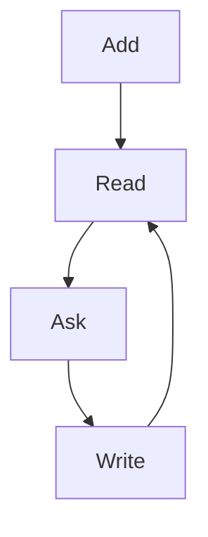

# Writing in Markdown

Markdown notes, Labs, plain text, CSV, SVG, HTML and p5 sketches can all be edited here. This chapter is a Markdown note, so everything it describes can be tried on this page.

## Edit and save

Choose **Source** in the tab bar. The source opens beside the rendered note, and the note follows as you type. The tab shows ● while there are unsaved changes.

**Save**, or ⌘S on a Mac and Ctrl+S elsewhere, keeps the change in this browser. To keep a copy on your computer, use **Save as…** in Files.

Two situations ask you to choose:

- **The saved copy changed** while you were editing, because the assistant or an update changed the file. Choose **Reload saved copy** to take the new version, or **Overwrite with draft** to keep yours.
- **You close a tab with unsaved changes.** Choose **Save and close**, **Discard and close** or **Cancel**.

## Reading appearance

**Reading appearance**, at the right of the toolbar, sets:

- **Text size**, from 12 to 20.
- **Page width**: **Focused** keeps lines short; **Full width** uses the whole tab.
- **Theme**: **Light**, **Paper** or **Dark**.

The same settings apply to Word documents. When a note has headings, the button at the left of the toolbar shows a table of contents.

## Formulas

Write `$…$` for a formula inside a sentence and `$$…$$` for one on its own line. `\(…\)` and `\[…\]` work too. The wave in [[Explore a wave]] is $y(t) = A\sin(2\pi f t)$, and its average energy over one period is

$$
\frac{1}{T}\int_0^T A^2 \sin^2(2\pi f t)\,dt = \frac{A^2}{2}
$$

## Diagrams

A fenced block marked `mermaid` becomes a diagram:



## Images

An image in the library can be shown with the usual Markdown syntax. A path is read from the note's own folder, or from the top of the library when it starts with `/`. Put a path with spaces in angle brackets:

```markdown

```


Images from other websites are not loaded; their description is shown instead. To show an image, a sketch or a page by its name instead of its path, use an embed: see [[Links and embeds]].

## Try it

1. Open **Source** and change the diagram: add an arrow from `D` to `A`.
2. Write a formula of your own under **Formulas**, then **Save**.
3. Choose **Reading appearance** and try **Paper** with **Full width**.
